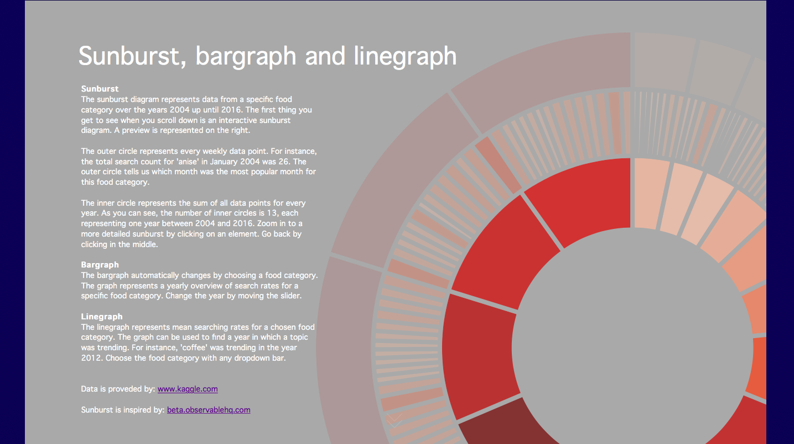

# Programming project 2019 - Food trends based on Google searches
Minor programming UvA  
Name: Rebecca Davidsson  
Student number: 11252138
E-mail: rebeccadavidsson3@gmail.com

# [Github Page](https://rebeccadavidsson.github.io/project/index.html)

# Demonstration video TODO

# Page walkthrough
The page starts with a header than can be scrolled down by clicking on the scroll button (or by scrolling down).
After scrolling down, a page with information about the visualisations appears as an introduction to the page. An (interactive) sunburst preview is presented on the background. The other visualisations are presented as the user scrolls down.

### Sunburst and barchart(s)

**The sunburst** diagram represents data from a specific food category over the years 2004 up until 2016. The first thing you get to see when you scroll down is an interactive sunburst diagram. A preview is represented on the right.

The outer circle represents every weekly data point. For instance, the total search count for 'anise' in January 2004 was 26. The outer circle tells us which month was the most popular month for this food category.

The inner circle represents the sum of all data points for every year. As you can see, the number of inner circles is 13, each representing one year between 2004 and 2016. Zoom in to a more detailed sunburst by clicking on an element. Go back by clicking in the middle.

**The bargraph** automatically changes by choosing a food category. The graph represents a yearly overview of search rates for a specific food category. Change the year by moving the slider.

### Linechart

**The linegraph** represents mean searching rates for a chosen food category. The graph can be used to find a year in which a topic was trending. For instance, 'coffee' was trending in the year 2012. Choose the food category with any dropdown bar.

# Data and sources
All data is downloaded from [kaggle.com](https://www.kaggle.com/GoogleNewsLab/food-searches-on-google-since-2004) as a csv file. Other related datasets can be downloaded from [Google.com](https://trends.google.com/trends/?geo=US). 

# How to use this page with other dataset(s)
1. Download dataset as a csv file from https://trends.google.com/trends/?geo=US or https://www.kaggle.com/GoogleNewsLab/food-searches-on-google-since-2004 . Make sure dataset has this format:

2. Make sure the downloaded csv-file is saved in the correct folder (i.e. make a folder called 'results' to store the file).
3. Convert data with `converter.py`
4. Change foodnames to categories from your own dataset.
  * In `sunburst.js`, selected foodnames are "frozen-yogurt", "pie", "anise", and "cauliflower".
  * In `barcharts.js` an array of foodnames is made out of 'foods = ["easter-egg", "apricot", "blueberry", "strawberry"]'
  * in `linechart.js`, an array of foodnames is made out of 'dataset = ["empanada", "quinoa", "cauliflower", "coffee"]'
5. If you want to change the years (for example to 2004-2019 instead of 2004-2016), add these years to the years array in `main.js` and other files.

<i>
This project is licensed under the terms of the MIT license. 
Rebecca Davidsson, 2019
</i>

