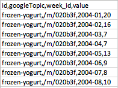

# Programming project 2019 - Food trends based on Google searches
Minor programming UvA  
Name: Rebecca Davidsson  
Student number: 11252138
E-mail: rebeccadavidsson3@gmail.com

# Structure

# How to use this page

# How to use this page with another dataset
1. Download dataset as a csv file from https://trends.google.com/trends/?geo=US or https://www.kaggle.com/GoogleNewsLab/food-searches-on-google-since-2004 . Make sure dataset has this format:

2. Make sure the downloaded csv-file is saved in the correct folder (i.e. make a folder called 'results' to store the file).
3. Convert data with `converter.py`
4. Change foodnames to categories from your own dataset.
  * In `sunburst.js`, selected foodnames are "frozen-yogurt", "pie", "anise", and "cauliflower".
  * In `barcharts.js` an array of foodnames is made out of 'foods = ["easter-egg", "apricot", "blueberry", "strawberry"]'
  * in `linechart.js`, an array of foodnames is made out of 'dataset = ["empanada", "quinoa", "cauliflower", "coffee"]'
