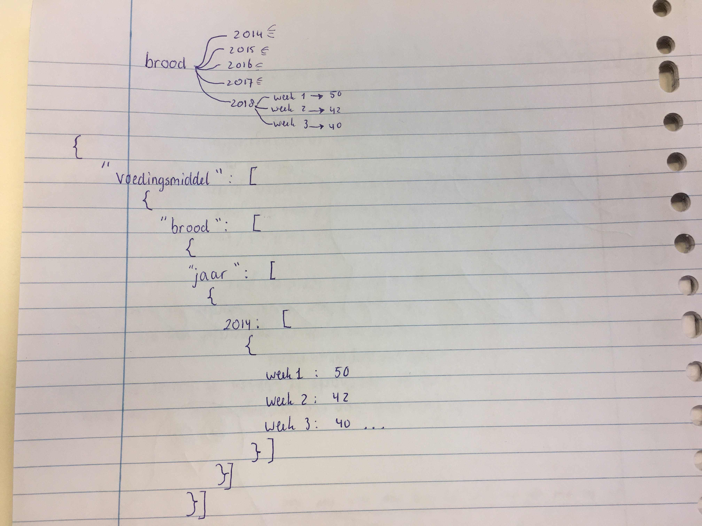

# Programmeerproject 2019
Minor programmeren UvA
Naam: Rebecca Davidsson
Student nummer: 11252138

https://rebeccadavidsson.github.io/project/index.html#three

## Google zoekopdrachten naar voeding vanaf 2004 t/m 2016
Welke soorten voeding worden het meest opgezocht in welke jaarperiode?
Deze visualisatie biedt gebruikers de mogelijkheid tot een overzicht over Google trends omtrent voeding.

## Features
De gebruiker kan bij openen van de pagina een paar bar charts aflezen van interessante voeding categorieën. Hier kan vervolgens op geklikt worden (waarmee dus een voedingscategorie wordt gekozen). Vervolgens wordt uit deze keuze een sunburst gemaakt (zie kopje sunburst voor details). Naast de sunburst wordt ook een linechart gemaakt van de gekozen categorie en wordt er tegelijkertijd onder de sunburst een barchart gevormd.

### Sunburst
De sunburst zal bestaan uit alle jaren van de dataset van de gekozen voeding. Als een voeding in 2014 meer is opgezocht dan in 2015, dan zal de burst van 2014 dus groter zijn. De grootte van de bursts is representatief voor het aantal keer dat de voeding is opgezocht. Op de burst kan geklikt worden, waarna er informatie wordt gegeven over het jaar zelf. Zo kan er bijvoorbeeld gezien worden dat er in de zomer vaker naar 'icecream' is gezocht dan in de winter.
Het doel hiervan is de gebruiker overzichtelijke informatie geven over de opzoekwaardes van een voedingscategorie.

### Externe componenten
D3
jQuery

### Data
Alle data staat in 1 bestand en kan gevonden worden op:
https://www.kaggle.com/GoogleNewsLab/food-searches-on-google-since-2004
Uit deze dataset moeten de jaartallen en data nog omgezet worden in bruikbare getallen.

### Vergelijkbare data visualisaties
https://beta.observablehq.com/@mbostock/d3-zoomable-sunburst

### Moeilijkheden
1. De eerste moeilijkheid is het verwerken van de data zodat alles met goede datums in een json file staat. Hiervoor kan ik gebruik maken van een converter module die geschreven kan worden in Python.
Uiteindelijk wil ik de data in dit format:

2. Het maken van de sunburst gaat lastig worden, vooral om een smooth transition te maken. Als dit echt niet lukt is een andere data visualisatie zoals een barchart ook mogelijk.
3. Als het niet lukt om 2 of meer voedingsstoffen te kiezen voor de stacked bar chart dan kan er ook een normale barchart of line chart gemaakt worden van 1 voeding.

## Design

### Rebecca Davidsson
### Student number: 11252138
