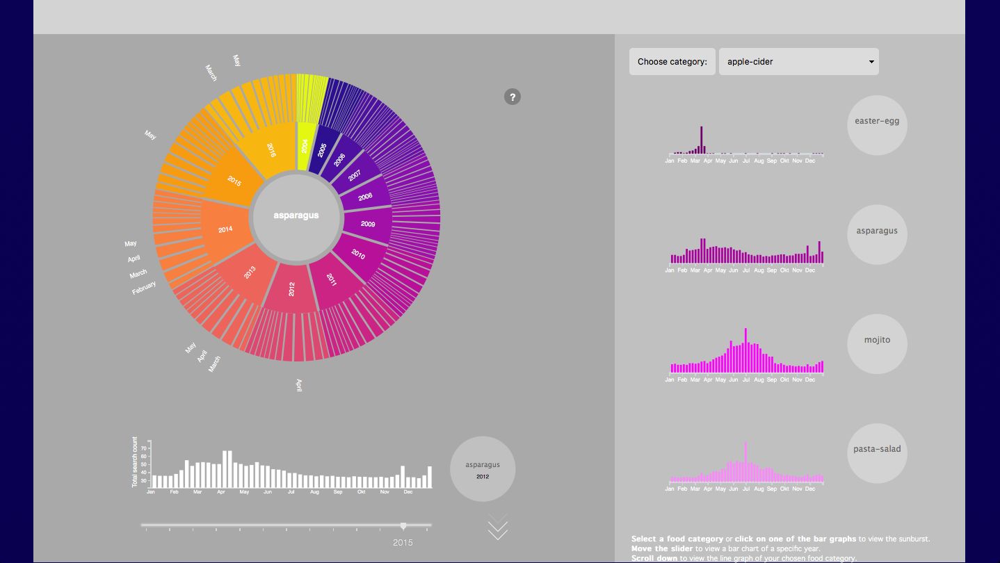
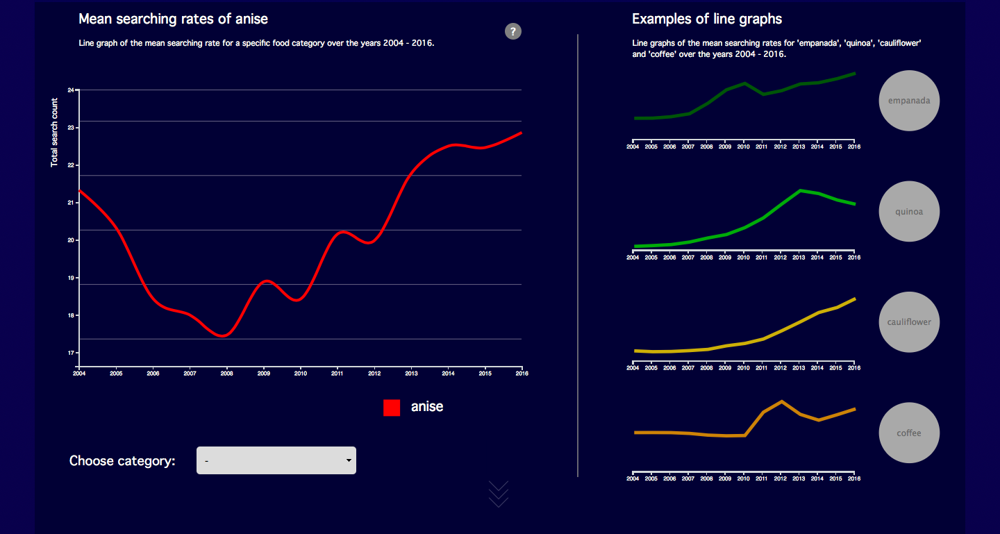
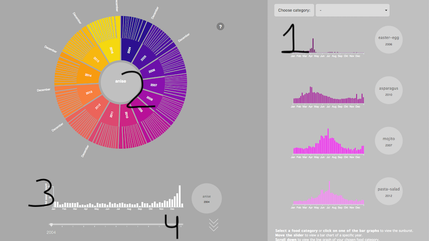
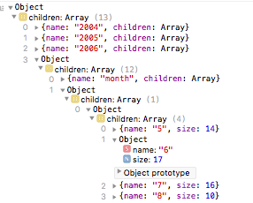

# Programming project 2019 - Food trends based on Google searches
Minor programming UvA
Name: Rebecca Davidsson
Student number: 11252138

## Visual design

## Technical design

### Javascript
This repository consists of 9 Javascript files and are all placed in the 'scripts'-folder.
1. **main.js:** main script to load data and call other functions.
Functions:
  * onload;
  * function to control scrolling events, [source: ](https://www.w3schools.com/jquery/tryit.asp?filename=tryjquery_eff_animate_smoothscroll)
  * function to control parallax effect, [source: ](https://codepen.io/martinwolf/pen/ZGXKEX/)
2. **barcharts.js:** makes a few interactive barcharts (see number 1 in the figure above). Features of this script are the tooltip and some onclick-events.
Also, this script consists of a function to make a dropdown and a slider.
Functions:
  * makeBarcharts;
  * addDropdown;
  * addSlider (see number 4 in the figure above);
  * updateYear: This is an update function that updates the barcharts when the slider is moved or when the selected year gets changed.
  * exploreBarCharts: This is a function to make mini barcharts at the end of the page. Only interactivity is a toolip.
3. **sunburst.js:** includes functions to make and update the sunburst(s) (see number 2 in the figure above).
Functions:
  * makeSunburst (main sunburst);
  * makeSunburstWelcome: a function to make the non-interactive sunburst at the top of the page to welcome the user with a sunburst preview.
  * updateSunburst: removes old sunburst, gets new data and draws a new sunburst.
  * makeUnderSunburst: function to make a sunburst without hidden layers (in contrast to the main sunburst, which does have hidden layers).
  * arcVisible
  * labelVisible
  * labelTransform
  * makePaths
  * makeLabel
  * makeParent
  * addTitle
  * clicked: zooms in or out of the sunburst when user clicks on one of the elements.
  * getMonthSunburst
4. **underBarchart.js:** makes the main interactive barchart (see number 3 in the figure above).
Functions:
    * makeUnderBarchart: function to make the initial barchart when the page is opened. Adds axes, title and position. Also includes the tooltip that works together with the sunburst; hovering over one of the bars in the barchart cuases that corresponding element to get highlighted in the sunburst.
    * updateUnderBarChart: updates the bar chart with a y-axis transition.
5. **linechart.js:** makes all linecharts (interactive and non-interactive).
Functions:
  * makeLinechart;
  * updateLineChart
  * linechartDropdown
  * updateLegend
  * makeMiniLinecharts
  * mousemove, [source: ](https://bl.ocks.org/alandunning/cfb7dcd7951826b9eacd54f0647f48d3)  
6. **getarrays.js:** converts data into useable arrays.

7. **d3-simple-slider.js:** script to make a slider, [source: ](https://github.com/johnwalley/d3-simple-slider   ).
8. **d3-tip.js:** tooltip script, [source: ](https://github.com/jprichardson/d3-tooltip).

### HTML
The only HTML-file in this repository is 'index.html' and includes all visualisations.

### CSS
* style.css: this is the main css file and includes all styles of svg, text, paragraphs etc.
* div.css: a file aspecially for all the div-elements.
* questionmark.css
* slider.css: besides the slider, this file also contains the styling of the dropdown menu's.
* arrow.css: styling for the arrow that lets the user scroll down.

### Python
The only python file in this repository is converter.py. This file converts the downloaded data into a format that can be used in Javascript. 

### Data

## Process and development

### Challenges
The hardest part of this project was creating a sunburst diagram and especially converting the data into a format that could be used for the sunburst. First, I tried to convert the data with a python script that made a dictionary. I wrote a recursive function that added nodes to a dictionary until the highest depth was reached. Then I encountered another problem; the dictionary did not handle differend key-names. After some research, I tried to write a recursive function in Javascript to convert the data, which was harder than I initially thought, because every depth of the dictionary had a different lenght (13 years, 12 months, 52 weeks). Eventually, I wrote some different functions to get the structure that I wanted (see figure).

Another challenge was to get all elements in the correct position on the page. I did not use bootstrap, because I was under the impression that using bootstrap-columns also ruled out other possibilities. Looking back, I don't know if that actually was a wise choice. On the other side, I learned so much about positioning of elements in HTML.

### Acquired Skills
* Never before had I heared of D3.partition(). I learned to partition data into parent, child, value and depth, which is useful for several things such as treemaps, packed circles or network graphs.
* In the previous course Data Processing, we didn't get to work with jQuery a lot. I used jQuery to select and find specific things in my HTML-file. Using D3 to do this would have made things a lot harder. Understanding jQuery made it easier to understand other aspects of Javascript and HTML.
* I also learned a lot about working with CSS and linking it to elements in an HTML file.
* Most of all, I learned about Javascript. Before starting this project, I didn't understand neither the onload-function nor the asynchronity of Javascript. For the first time, I used more than one Javascript-file to devide all functions.  

### Important changes
